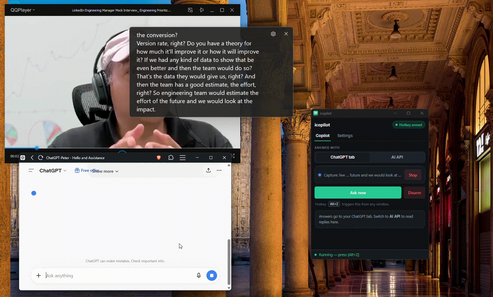

# Live Caption Copilot — Real-Time Live Caption Saver + AI Interview Copilot (Windows)

**Live Caption Copilot** is a Windows **live caption saver**, **real-time transcription**
tool, and **AI interview copilot**. It captures **Windows Live Captions** or
**Chrome Live Caption** into a clean transcript, then — on a single hotkey — sends
the latest lines to **ChatGPT**, **OpenAI**, **Ollama**, or any **OpenAI-compatible
API** for instant answers.

Ideal for **job interviews**, **meetings**, **accessibility**, **speech-to-text**,
**voice-to-text transcription**, content creators, and language learners.

**Version:** 2.0  
**Platform:** Windows 10 / 11  
**Also useful for:** live captioning · caption-to-text · GPT interview helper · meeting notes



---

## Topics / tags (for GitHub)

`live-caption` `livecaption` `live-captioning` `speech-to-text` `voice-to-text`
`transcription` `realtime-speech-to-text` `windows-live-captions` `chrome-live-caption`
`accessibility` `interview-copilot` `chatgpt` `openai` `ollama` `job-interviews`
`meeting-notes` `caption-saver` `audio-to-text` `speech-recognition` `windows`

---

# 👋 Hi, I'm Jeremy Arellano

🚀 **AI/ML Engineer | Software Developer | .NET / C++ / Java Specialist**

I'm passionate about creating scalable, intelligent, and accessible applications
that bridge technology and human needs.  
Currently working on **AI-driven accessibility tools** and real-time applications
using modern frameworks.

## 🧠 About Me

- 💼 Software Engineer experienced in **C++, C#, Java, and .NET Framework**
- 🤖 Enthusiastic about **AI/ML applications**, automation, and assistive technology
- 💡 Focused on transforming ideas into high-impact software solutions

---

## 🎯 Features

- **Real-time live caption capture**: Instantly converts Live Captions into plain text (speech-to-text / voice-to-text workflow).
- **Windows & Chrome caption sources**: Works with **Windows 11 Live Captions** and **Chrome Live Caption**.
- **Clean transcripts**: De-duplicates revising caption lines into one sentence per line — better than raw caption dumps.
- **AI interview copilot on hotkey**: Send the last N transcript lines to AI with a global hotkey (default `Alt+Z`).
- **Two answer modes**:
  - **ChatGPT tab** — auto-paste into chatgpt.com (GPT interview helper)
  - **AI API** — stream replies inside the app (OpenAI, Ollama, or any OpenAI-compatible endpoint)
- **Job interview & meeting ready**: Capture questions live and get concise help without leaving the call.
- **Save, copy, and reuse transcripts**: Store captioned text as files or copy AI answers to the clipboard.
- **System tray app**: Stays running in the background so capture and hotkey keep working.
- **Portable settings**: `config.json` lives next to the executable — no account required for local use.
- **No OCR for captions**: Reads caption text from the Live Caption UI (lightweight, fast, local capture).

---

## 🚀 How It Works

1. Ensure **Live Captions** are enabled (Windows: `Win` + `Ctrl` + `L`, or Chrome Live Caption).
2. Run **Live Caption Copilot** and click **Start** on the Copilot tab.
3. The app captures captions into a clean running transcript.
4. Press **Ask now** (or your armed hotkey) to send the latest lines to ChatGPT or your AI API.
5. Optionally save the transcript or copy the answer for later use.

**Loop:** capture → ask → answer.

> **Tip — run as Administrator.** For the global hotkey and caption-reading to
> work reliably when another app has focus, start the app **as Administrator**.

---

## 💡 Use Cases

- **Job interviews / GPT interviews**: Real-time caption capture + AI answers to the latest question.
- **Online meetings & calls**: Live captioning to text, meeting notes, and instant follow-up answers.
- **Content creators**: Save captions from videos/podcasts for scripts, clips, and analysis.
- **Accessibility**: Convert live captions into searchable, reusable transcripts.
- **Language learners**: Practice listening with voice-to-text transcripts and AI explanations.
- **Developers & researchers**: Feed captured speech-to-text into NLP, RAG, or automation pipelines.

---

## 🔧 Technologies Used

- **Windows desktop app** for high-performance real-time caption capture
- **Windows / Chrome Live Captions** as the caption source (no OCR required for caption text)
- **OpenAI-compatible HTTP API** (optional) for in-app streaming answers
- **Browser delivery** (optional) for ChatGPT tab paste / send

---

## 📦 Download

Install with **Live Caption Copilot** setup (`LiveCaptionCopilot_Setup.exe`), or run
`LiveCaptionCopilot.exe` from the release package.

---

## How to Use Live Caption Copilot

**Live Caption Copilot** listens to live captions on your screen, keeps a clean running
transcript of what's being said, and — on a single keypress — sends the last few
lines to an AI for an answer. It's designed to sit quietly in your system tray
and help you during live conversations, meetings, or interviews.

There are two ways to get an answer:

- **ChatGPT tab** — the app types the transcript into your open **chatgpt.com**
  browser tab and presses Enter for you.
- **AI API** — the app calls an OpenAI-compatible API directly and streams the
  reply back **inside the app**, so you never leave the window.

> **Platform:** Windows 10 / 11 only.

---

## 1. Before you start

You'll need:

- **Windows 10 or 11.**
- **Windows Live Captions** (built into Windows 11) — turn it on with
  <kbd>Win</kbd> + <kbd>Ctrl</kbd> + <kbd>L</kbd>. This is what produces the
  captions the app reads. (Chrome's own "Live Caption" feature also works as an
  alternative source.)
- For the **AI API** method: an API key from your provider (e.g. OpenAI), or a
  local server such as Ollama.

> **Tip — run as Administrator.** For the global hotkey and caption-reading to
> work reliably even when another app (like your browser) has focus, start
> Live Caption Copilot **as Administrator**. Windows blocks background key-sending to
> elevated windows otherwise.

The app opens to two tabs at the top: **Copilot** (the day-to-day controls) and
**Settings** (everything you configure once). A colored pill in the top-right
always shows what it's doing: **Idle**, **Capturing**, or **Hotkey armed**.

---

## 2. Quick start

1. **Open Settings → Transcript** and click **Browse…** to choose a text file to
   read from. *(Optional — if you skip this, the app creates a `captions.txt`
   for you the first time you start a capture.)*
2. Turn on **Windows Live Captions** with <kbd>Win</kbd> + <kbd>Ctrl</kbd> +
   <kbd>L</kbd>.
3. Go to the **Copilot** tab and click **Start** on the capture card. As people
   speak, you'll see the status change to "Capturing" and lines get written to
   your transcript.
4. Pick how you want answers under **Answer with**:
   - **ChatGPT tab** → open **chatgpt.com** in your browser first.
   - **AI API** → fill in your API key in Settings first (see §6).
5. When a question is asked, press **Ask now** — or arm the hotkey (§4) and press
   it from anywhere.

That's the whole loop: **capture → ask → answer**.

---

## 3. The Copilot tab (everyday use)

This is where you work once everything is set up.

### Answer with
A two-way switch at the top:

| Choice | What happens |
| --- | --- |
| **ChatGPT tab** | The transcript is delivered into your open ChatGPT browser tab. The answer appears **in the browser**. |
| **AI API** | The transcript is sent to your configured API. The answer streams **inside the app**, in a Response panel below. |

Your choice is remembered.

### Capture card
Shows a live dot and the current capture status. Click **Start** to begin
capturing captions, **Stop** to end. While capturing, the header pill turns blue
and reads "Capturing".

### Ask now / Arm hotkey
- **Ask now** — the main button. Grabs the last N lines of the transcript and
  gets an answer using whichever method you picked above.
- **Arm hotkey / Disarm** — registers (or removes) your global hotkey so you can
  trigger the exact same action **without switching back to the app**. Once
  armed, the pill reads "Hotkey armed" and a hint shows the current combo (e.g.
  <kbd>Alt+Z</kbd>).

### Response panel (AI API only)
When **Answer with** is set to **AI API**, the reply streams into a Response
panel here token-by-token. You can:

- **Scroll up** while it's still writing to read earlier text — it won't yank you
  back to the bottom. Scroll to the bottom again to resume auto-follow.
- Click **Copy** once it's finished to copy the full answer to your clipboard.

In **ChatGPT tab** mode this panel is replaced by a short note reminding you the
answer went to your browser.

---

## 4. Setting your hotkey

The hotkey lets you fire **Ask now** from any window — your browser, a video
call, anywhere.

1. Go to **Settings → Trigger**.
2. Either type a combo directly into the box (Tauri accelerator format, e.g.
   `Alt+Z`, `Control+Alt+Z`), **or** click **Record** and physically press the
   key combination you want.
3. Back on the **Copilot** tab, click **Arm hotkey**.

The default is <kbd>Alt+Z</kbd>. You can't change the hotkey while it's armed —
disarm first.

---

## 5. Live captions (the transcript source)

Found under **Settings → Live captions**.

- **Source** — choose where captions come from:
  - **Windows** — Windows 11's built-in Live Captions (recommended).
  - **Chrome** — Chrome's own Live Caption feature.
- **Clear file on start** — when checked, the transcript file is wiped each time
  you press Start, so every session begins fresh. Uncheck it to keep appending.

The app de-duplicates as it writes: each finished sentence is stored **once, in
its best version**, one sentence per line — so the transcript stays clean even
though live captions constantly revise themselves.

> Remember: the app doesn't generate captions itself. You must have Windows (or
> Chrome) Live Captions **turned on and visible** for there to be anything to
> read. Enable Windows Live Captions with <kbd>Win</kbd> + <kbd>Ctrl</kbd> +
> <kbd>L</kbd>.

### Cleaning up a transcript
**Settings → Transcript → Clean transcript…** takes a raw capture file and
collapses it into the best version of each sentence, writing a new
`*.clean.txt` next to the original. Useful for tidying up a saved session.

---

## 6. Using the AI API method

Set this up under **Settings → AI · OpenAI-compatible** if you want answers
inside the app instead of in a browser tab.

| Field | What to enter |
| --- | --- |
| **Base URL** | Your provider's API root. Default `https://api.openai.com/v1`. For a local model, use e.g. `http://localhost:11434/v1` (Ollama). |
| **API key** | Your secret key (sent as a bearer token). Shown as dots. |
| **Model** | The model id, e.g. `gpt-4o-mini`. |
| **System prompt** | Optional instructions that shape every answer. Comes pre-filled with an "interview copilot" prompt that answers the most recent question concisely — edit it to taste. |

Then, on the Copilot tab, set **Answer with → AI API** and press **Ask now** (or
your hotkey). The last N transcript lines are sent as your message and the answer
streams into the Response panel.

> Works with any OpenAI-compatible endpoint — hosted providers or a local server.

---

## 7. Using the ChatGPT tab method

Configure this under **Settings → ChatGPT delivery**. Open **chatgpt.com** in
your browser first.

**Send mode** — how the transcript reaches ChatGPT:

| Mode | Behavior |
| --- | --- |
| **Clipboard only** | Copies the text to your clipboard; you paste it yourself. |
| **Auto-paste + Enter** | Pastes into the ChatGPT box and presses Enter — fully hands-off. *(default)* |
| **Inject (no Enter)** | Pastes the text but doesn't send it, so you can edit before hitting Enter. |

**Target** — reuse the **Existing tab**, or open a **New tab each time**.

**Window** — pick which ChatGPT window to target from the dropdown. Choose **Any
ChatGPT window** to use the first one found, or select a specific open window
from the list (click **Refresh list** if it's empty). If none appear, open
**chatgpt.com** and refresh.

> These options are locked while the hotkey is armed — disarm to change them.

---

## 8. How many lines get sent (N)

**Settings → Transcript → Lines to send** controls how many of the most recent
transcript lines are sent with each ask. The default is **4**. Raise it to give
the AI more context; lower it to keep the question tightly focused on what was
just said.

---

## 9. Living in the tray

- Clicking the window's **X** doesn't quit the app — it **hides to the system
  tray** and keeps running (so your hotkey and capture stay active).
- **Left-click the tray icon** to bring the window back.
- **Right-click the tray icon** for a menu: **Show** or **Quit**.

The window remembers its size and position between launches.

---

## 10. Where your settings live

All settings are saved automatically to a **`config.json`** file kept **next to
the executable** (so a portable copy carries its own settings). This
includes your API key, hotkey, model, and preferences. Keep the folder private
if your API key is stored there.

---

## 11. Troubleshooting

| Symptom | Fix |
| --- | --- |
| **Hotkey does nothing when another app is focused** | Restart the app **as Administrator**. Windows blocks input to elevated windows otherwise. |
| **Nothing appears in the transcript while capturing** | Make sure Windows Live Captions is actually **on and showing text** (<kbd>Win</kbd> + <kbd>Ctrl</kbd> + <kbd>L</kbd>), and that the **Source** matches (Windows vs Chrome). |
| **"Select a transcript file first"** | Choose a file under Settings → Transcript, or just press **Start** on the capture card to auto-create one. |
| **AI API error / "no API key set"** | Fill in the API key (and check Base URL and Model) under Settings → AI. |
| **"No ChatGPT window open"** | Open **chatgpt.com** in your browser, then click **Refresh list** in the Window dropdown. |
| **ChatGPT paste lands in the wrong place** | Make sure the ChatGPT input box is focused, and consider **Inject (no Enter)** mode so you can check before sending. |
| **"Asking…" never finishes** | The API request timed out or stalled; check your connection, Base URL, and that the server is reachable. |

---

## 📝 License

This project is licensed under the MIT License.

---

## 🌐 Keywords & search terms

**Product:** Live Caption Copilot · Live Caption Saver · caption saver · live caption tool · interview copilot

**Capture / transcription:** live caption · live captions · live captioning · Chrome Live Caption · Windows Live Captions · speech-to-text · voice-to-text · audio-to-text · speech recognition · real-time transcription · realtime speech-to-text · caption-to-text · caption generator · closed captions · subtitle capture

**AI / productivity:** ChatGPT · GPT · OpenAI · Ollama · OpenAI-compatible API · AI interview helper · interview assistant · meeting notes · AI copilot · hotkey AI

**Audience:** job interviews · accessibility · content creators · language learning · Windows 10 · Windows 11

**Suggested GitHub Topics (paste into repo Settings → Topics):**

```
live-caption
livecaption
live-captioning
speech-to-text
voice-to-text
transcription
realtime-speech-to-text
windows-live-captions
chrome-live-caption
accessibility
interview-copilot
chatgpt
openai
ollama
job-interviews
meeting-notes
caption-saver
audio-to-text
speech-recognition
windows
```

---

## 🧭 Goals for 2025+

- 🚀 Launch open-source AI / accessibility projects
- 💬 Share tech insights via blog posts
- 🎯 Contribute to accessibility-focused open-source tools

⭐️ _If you find my work useful, please consider giving a star!_

---

*Live Caption Copilot — real-time live caption saver + AI interview copilot for Windows.*
